# TTS Teams Structure

```mermaid
graph TD
    classDef topLevel fill:#f96,stroke:#333,stroke-width:2px
    classDef secondLevel fill:#9cf,stroke:#333,stroke-width:1px
    classDef thirdLevel fill:#cfc,stroke:#333,stroke-width:1px
    classDef fourthLevel fill:#fcf,stroke:#333,stroke-width:1px
    classDef specialTeam fill:#fc9,stroke:#333,stroke-width:2px,stroke-dasharray: 5 5

    %% Top Level Organization
    q2["Technology-Transformation-Services (Q2)"]
    
    %% Handbook Teams
    handbook["Handbook-Owners"]
    gsa_handbook["GSA-TTS-Handbook-Owners"]
    operations_handbook["Operations-Handbook-Owners"]
    solutions_handbook["Solutions-Handbook-Owners"]
    
    %% Main Divisions
    q2a["TTS-Delivery (Q2A)"]
    q2b["TTS-Operations (Q2B)"]
    q2c["TTS-Fellowship-Office (Q2C)"]
    q2a0a["Technology-Operations-Division (Q2A0A)"]
    q2adb["Centers-of-Excellence-Division (Q2ADB)"]

    %% Office of TTS Delivery Subdivisions
    q2aa["Office-of-Solutions (Q2AA)"]
    q2ab["Office-of-Regulatory-and-Oversight-Systems (Q2AB)"]
    q2ac["Office-of-Integrated-Award-Environment (Q2AC)"]

    %% Office of TTS Operations Subdivisions
    q2ba["Acquisition-Division (Q2BA)"]
    q2bb["Business-Operations-Division (Q2BB)"]
    q2bc["Market-Development-and-Partnerships-Division (Q2BC)"]
    q2bd["Outreach-and-Marketing-Division (Q2BD)"]

    %% Office of Solutions Teams
    q2aaa["Cloud-gov-Division (Q2AAA)"]
    q2aab["Login-gov-Division (Q2AAB)"]
    q2aac["Platforms-and-Services-Division (Q2AAC)"]
    q2aad["Public-Experience-Division (Q2AAD)"]
    q2aae["FedRAMP-Division (Q2AAE)"]
    q2aaf["Accelerators-Division (Q2AAF)"]

    %% Parent-Child Relationships - Top Level
    q2 --> q2a
    q2 --> q2b
    q2 --> q2c
    q2 --> q2a0a
    q2 --> q2adb

    %% Parent-Child Relationships - Handbook Teams
    q2b --> handbook
    handbook --> gsa_handbook
    handbook --> operations_handbook
    handbook --> solutions_handbook

    %% Parent-Child Relationships - Office of TTS Delivery
    q2a --> q2aa
    q2a --> q2ab
    q2a --> q2ac

    %% Parent-Child Relationships - Office of TTS Operations
    q2b --> q2ba
    q2b --> q2bb
    q2b --> q2bc
    q2b --> q2bd

    %% Parent-Child Relationships - Office of Solutions
    q2aa --> q2aaa
    q2aa --> q2aab
    q2aa --> q2aac
    q2aa --> q2aad
    q2aa --> q2aae
    q2aa --> q2aaf

    %% Style Applications
    class q2 topLevel
    class q2a,q2b,q2c,q2a0a,q2adb secondLevel
    class q2aa,q2ab,q2ac,q2ba,q2bb,q2bc,q2bd thirdLevel
    class q2aaa,q2aab,q2aac,q2aad,q2aae,q2aaf fourthLevel
    class handbook,gsa_handbook,operations_handbook,solutions_handbook specialTeam
```

## Team Ownership

Teams inherit permissions from their parent teams. 

### Key Teams for Handbook Management

- **Technology-Transformation-Services (Q2)**: Top-level organization
- **Handbook-Owners**: Team responsible for overall handbook management
- **GSA-TTS-Handbook-Owners**: Team responsible for GSA-TTS specific content
- **Technology-Operations-Division (Q2A0A)**: Technical management of the handbook platform

### Content Ownership

Teams own specific sections of the handbook content as defined in the CODEOWNERS file:

- **Outreach-and-Marketing-Division**: Office of Operations content
- **Acquisition-Division**: Office of Acquisition content
- **Office-of-Solutions**: Office of Solutions content
- **Centers-of-Excellence-Division**: CoE content
- **Technology-Operations-Division**: Tools content
- **Business-Operations-Division**: Training, Travel and Leave content
